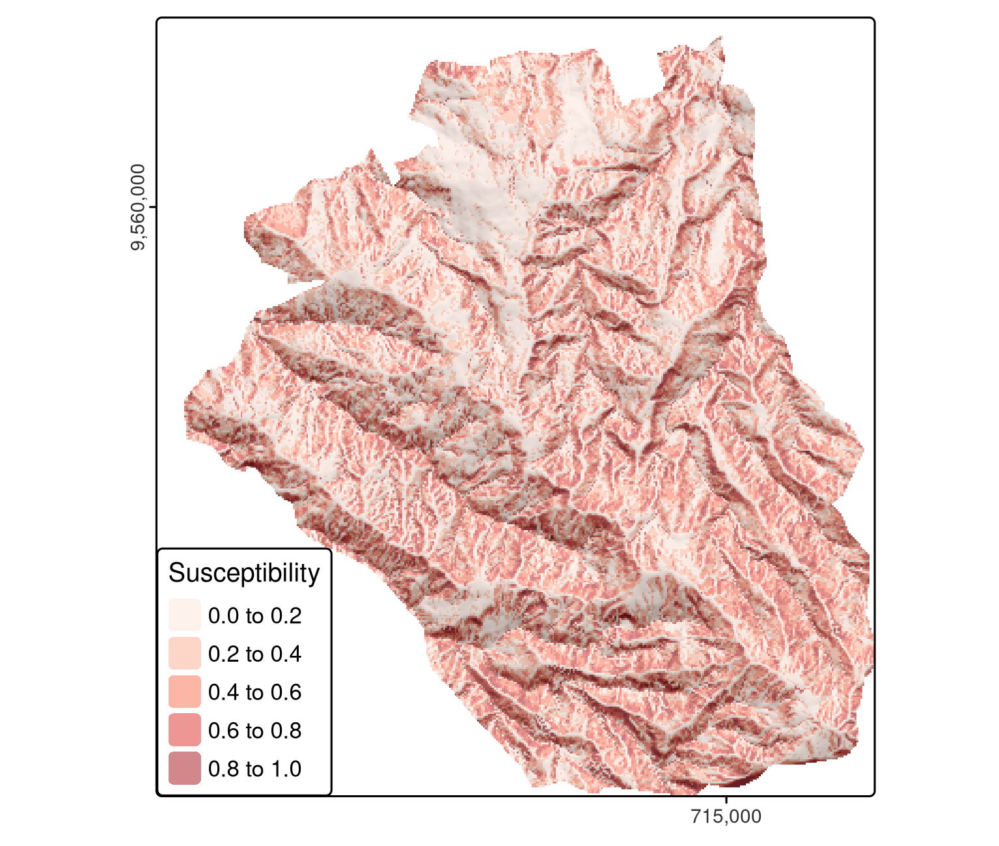
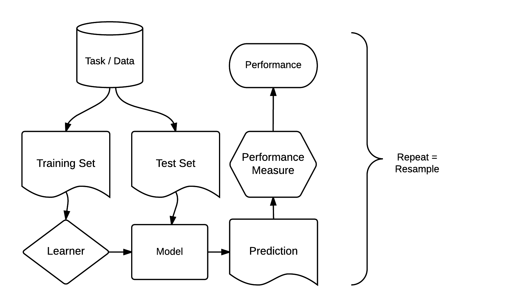

---
output:
  pdf_document: default
  html_document: default
---
# Statistical learning for Lanslide Analysis

```{r, include=FALSE}
source("./before_script.R")
```

```{r 12-knitr-settings, include=FALSE}
knitr::opts_chunk$set(cache = FALSE)
```

## Prerequisites {-}

- geographic data analysis
- Generalized Linear Models (GLM)
- machine learning


```{r 12-spatial-cv-1, message=FALSE}
library(sf)
library(terra)
library(dplyr)
library(future)             # parallel processing
library(lgr)                # logging framework for R
library(mlr3)               # unified interface to machine learning algorithms
library(mlr3learners)       # most important machine learning algorithms
#library(mlr3extralearners)  # access to even more learning algorithms
#library(mlr3proba)          # here needed for mlr3extralearners::list_learners()
library(mlr3spatiotempcv)   # spatiotemporal resampling strategies
library(mlr3tuning)         # hyperparameter tuning
library(mlr3viz)            # plotting functions for mlr3 objects
library(progressr)          # report progress updates
library(pROC)               # compute roc values
```

Required data will be attached in due course.

## Introduction {#intro-cv1}


This use-case focuses on supervised learning techniques.
Response variables are:

- binary (such as landslide occurrence), 
- categorical (land use), integer (species richness count) or 
- numeric (soil acidity measured in pH).

The supervised techniques will be used to model the relationship between such responses --- which are known for a sample of observations --- and one or more predictors.

The primary aim is to make good predictions.

This case study concerns the modeling of occurrence of landslides.

1. introduce modeling and cross-validation concepts with the help of a GLM
2. implement a more typical machine learning  algorithm, namely a Support Vector Machine (SVM).
3. asses **predictive performance**  using spatial cross-validation (CV), which accounts for the fact that geographic data is special.

Spatial CV is the **central** theme in this case-study.


## Case study: Landslide susceptibility 

This case study is based on a dataset of landslide locations in Southern Ecuador, illustrated in Figure  and described in detail in Muenchow, Jannes, Alexander Brenning, and Michael Richter. 2012. “Geomorphic Process Rates of Landslides Along a Humidity Gradient in the Tropical Andes.” Geomorphology 139–140 (February): 271–84. https://doi.org/10/dp554q.

A subset of the dataset used in the paper is provided in the **spDataLarge** package, which can be loaded as follows:

```{r 12-spatial-cv-2}
data("lsl", "study_mask", package = "spDataLarge")
ta = terra::rast(system.file("raster/ta.tif", package = "spDataLarge"))
```

The above code loads three objects: 

- a `data.frame` named `lsl`, 
- an `sf` object named `study_mask` and 
- a `SpatRaster` (class that represents raster objects of terra) named `ta` containing terrain attribute rasters.

The dataframe `lsl` contains a factor column `lslpts` where `TRUE` corresponds to an observed landslide 'initiation point', with the coordinates stored in columns `x` and `y`.
The landslide initiation point is located in the scarp of a landslide polygon. 

There are 175 landslide and 175 non-landslide points, as shown by `summary(lsl$lslpts)`.

The 175 non-landslide points were sampled randomly from the study area, with the restriction that they must fall outside a small buffer around the landslide polygons.

```{r lsl-map, echo=FALSE, out.width="70%", fig.cap="Landslide initiation points (red) and points unaffected by landsliding (blue) in Southern Ecuador.", fig.scap="Landslide initiation points."}
# library(tmap)
# data("lsl", package = "spDataLarge")
# ta = terra::rast(system.file("raster/ta.tif", package = "spDataLarge"))
# lsl_sf = sf::st_as_sf(lsl, coords = c("x", "y"), crs = "EPSG:32717")
# hs = terra::shade(slope = ta$slope * pi / 180,
#                   terra::terrain(ta$elev, v = "aspect", unit = "radians"))
# # so far tmaptools does not support terra objects
# bbx = tmaptools::bb(raster::raster(hs), xlim = c(-0.0001, 1),
#                     ylim = c(-0.0001, 1), relative = TRUE)
# map = tm_shape(hs, bbox = bbx) +
#   tm_grid(col = "black", n.x = 1, n.y = 1, labels.inside.frame = FALSE,
#           labels.rot = c(0, 90), lines = FALSE) +
#   tm_raster(col.scale = tm_scale(values = gray(0:100 / 100), n = 100), col.legend = tm_legend_hide()) +
#   tm_shape(ta$elev) +
#   tm_raster(col_alpha = 0.6, col.scale = tm_scale(values = hcl.colors(25, "Geyser")), col.legend = tm_legend_hide()) +
#   tm_shape(lsl_sf) +
#   tm_symbols(fill = "lslpts", size = 0.5, col = "white",
#              fill.scale = tm_scale(values = c("#0071A6", "#C73000")), fill.legend = tm_legend(title = "Landslide: ")) +
#   tm_layout(inner.margins = rep(0, 4), legend.bg.color = "white", legend.position = tm_pos_in())
# tmap::tmap_save(map, filename = "images/lsl-map-1.png", width = 11,
#               height = 11, units = "cm")

```


The first three rows of `lsl`, rounded to two significant digits, can be found in Table.

```{r lslsummary, echo=FALSE, warning=FALSE}
lsl_table = lsl |>
  mutate(across(.cols = -any_of(c("x", "y", "lslpts")), ~signif(., 2)))
knitr::kable(lsl_table[c(1, 2, 350), ], caption = "Structure of the lsl dataset.",
             caption.short = "`lsl` dataset.", booktabs = TRUE) |>
  kableExtra::kable_styling(latex_options = "scale_down")
```

To model landslide susceptibility, we need some predictors.
Since terrain attributes are frequently associated with landsliding, we have already extracted the following terrain attributes from `ta` to `lsl`:

- `slope`: slope angle (°)
- `cplan`: plan curvature (rad m$^{-1}$) expressing the convergence or divergence of a slope and thus water flow
- `cprof`: profile curvature (rad m$^{-1}$) as a measure of flow acceleration, also known as downslope change in slope angle
- `elev`: elevation (m a.s.l.) as the representation of different altitudinal zones of vegetation and precipitation in the study area
- `log10_carea`: the logarithm of the catchment area (log10 m$^{2}$) representing the amount of water flowing toward a location

It might be a worthwhile exercise to compute the terrain attributes with the help of R-GIS bridges and extract them to the landslide points (see Exercise section).

## Conventional modeling approach in R {#conventional-model}

The **mlr3** package is an umbrella package providing a unified interface to dozens of learning algorithms - see below.

This introduction to supervised statistical learning provides the basis for doing spatial CV and contributes to a better understanding of the **mlr3** approach presented afterwards.

Recall that supervised learning involves predicting a response variable as a function of predictors. 
In R, modeling functions are usually specified using formulas (see `?formula` for more details on R formulas).
The following command specifies and runs a generalized linear model:

```{r 12-spatial-cv-6}
fit = glm(lslpts ~ slope + cplan + cprof + elev + log10_carea,
          family = binomial(),
          data = lsl)
```

It is worth understanding each of the three input arguments:

- A formula, which specifies landslide occurrence (`lslpts`) as a function of the predictors
- A family, which specifies the type of model, in this case `binomial` because the response is binary (see `?family`)
- The data frame which contains the response and the predictors (as columns)

The results of this model can be printed as follows (`summary(fit)` provides a more detailed account of the results):

```{r 12-spatial-cv-7}
class(fit)
fit
```

The model object `fit`, of class `glm`, contains the coefficients defining the fitted relationship between response and predictors, $y = f(x).$
It can also be used for prediction.
This is done with the generic `predict()` method, which in this case calls the function `predict.glm()`.
Setting `type` to `response` returns the predicted probabilities (of landslide occurrence) for each observation in `lsl`, as illustrated below (see `?predict.glm`).

```{r 12-spatial-cv-8}
pred_glm = predict(object = fit, type = "response")
head(pred_glm)
```

Spatial distribution maps can be made by applying the coefficients to the predictor rasters. 
This can be done manually or with `terra::predict()`.
In addition to a model object (`fit`), the latter function also expects a `SpatRaster` with the predictors (raster layers) named as in the model's input data frame (Figure).

```{r 12-spatial-cv-9, eval=FALSE}
# making the prediction
pred = terra::predict(ta, model = fit, type = "response")
```

```{r lsl-susc, echo=FALSE, out.width="70%",fig.cap="Spatial distribution mapping of landslide susceptibility using a GLM.", fig.scap = "Spatial distribution of landslide susceptibility.", warning=FALSE}
# attach study mask for the natural part of the study area
# data("lsl", "study_mask", package = "spDataLarge")
# ta = terra::rast(system.file("raster/ta.tif", package = "spDataLarge"))
# study_mask = terra::vect(study_mask)
# lsl_sf = sf::st_as_sf(lsl, coords = c("x", "y"), crs = 32717)
# hs = terra::shade(ta$slope * pi / 180,
#                   terra::terrain(ta$elev, v = "aspect", unit = "radians"))
# bbx = tmaptools::bb(raster::raster(hs), xlim = c(-0.0001, 1),
#                     ylim = c(-0.0001, 1), relative = TRUE)
# map2 = tm_shape(hs, bbox = bbx) +
#   tm_grid(col = "black", n.x = 1, n.y = 1, labels.inside.frame = FALSE,
#           labels.rot = c(0, 90), lines = FALSE) +
#   tm_raster(col.scale = tm_scale(values = "white"), col.legend = tm_legend_hide()) +
#   tm_shape(terra::mask(hs, study_mask), bbox = bbx) +
# 	tm_raster(col.scale = tm_scale(values = gray(0:100 / 100), n = 100), col.legend = tm_legend_hide()) +
#   tm_shape(terra::mask(pred, study_mask)) +
# 	tm_raster(col_alpha = 0.5, col.scale = tm_scale(values = "Reds", n = 6),
# 	          col.legend = tm_legend(title = "Susceptibility")) +
# 	tm_layout(legend.position = c("LEFT", "BOTTOM"),
# 	          legend.title.size = 0.8,
# 	          inner.margins = rep(0, 4))
# tmap::tmap_save(map2, filename = "images/lsl-susc-1.png", width = 13,
#               height = 11, units = "cm")

```

Here, when making predictions, we have neglected spatial autocorrelation since we assume that on average the predictive accuracy remains the same with or without spatial autocorrelation structures.
However, it is possible to include spatial autocorrelation structures into models as well as into predictions.
Though, this is beyond the scope, we give the interested reader some pointers where to look it up:

1. The predictions of regression kriging combines the predictions of a regression with the kriging of the regression's residuals. 
2. One can also add a spatial correlation (dependency) structure to a generalized least squares model  [`nlme::gls()`].  
3. One can also use mixed-effect modeling approaches.


Spatial distribution mapping is one very important outcome of a model (Figure above).
Even more important is how good the underlying model is at making them since a prediction map is useless if the model's predictive performance is bad.
One of the most popular measures to assess the predictive performance of a binomial model is the Area Under the Receiver Operator Characteristic Curve (AUROC).
This is a value between 0.5 and 1.0, with 0.5 indicating a model that is no better than random and 1.0 indicating perfect prediction of the two classes. 
Thus, the higher the AUROC, the better the model's predictive power.
The following code chunk computes the AUROC value of the model with `roc()`, which takes the response and the predicted values as inputs. 
`auc()` returns the area under the curve.

```{r 12-spatial-cv-10, message=FALSE, eval=FALSE}
pROC::auc(pROC::roc(lsl$lslpts, fitted(fit)))
#> Area under the curve: 0.8216
```

An AUROC value of 0.82 represents a good fit.
However, this is an overoptimistic estimation since we have computed it on the complete dataset. 
To derive a bias-reduced assessment, we have to use cross-validation and in the case of spatial data should make use of spatial CV.

## Introduction to (spatial) cross-validation {#intro-cv} 

As seen in the course, cross-validation belongs to the family of resampling methods.

The basic idea is to split (repeatedly) a dataset into training and test sets whereby the training data is used to fit a model which then is applied to the test set.
Comparing the predicted values with the known response values from the test set (using a performance measure such as the AUROC in the binomial case) gives a bias-reduced assessment of the model's capability to generalize the learned relationship to independent data.

For example, a 100-repeated 5-fold cross-validation means to randomly split the data into five partitions (folds) with each fold being used once as a test set (see upper row of Figure below). 
This guarantees that each observation is used once in one of the test sets, and requires the fitting of five models.
Subsequently, this procedure is repeated 100 times.
Of course, the data splitting will differ in each repetition.
Overall, this sums up to 500 models, whereas the mean performance measure (AUROC) of all models is the model's overall predictive power.

However, geographic data is special.
As was seen, the 'first law' of geography states that points close to each other are, generally, more similar than points further away.
This means these points are not statistically independent because training and test points in conventional CV are often too close to each other (see first row of Figure below).
'Training' observations near the 'test' observations can provide a kind of 'sneak preview' (data leak):
information that should be unavailable to the training dataset.

To alleviate this problem, 'spatial partitioning' is used to split the observations into spatially disjointed subsets (using the observations' coordinates in a *k*-means clustering; second row of Figure below).
This partitioning strategy is the **only** difference between spatial and conventional CV.
As a result, spatial CV leads to a bias-reduced assessment of a model's predictive performance, and hence helps to avoid overfitting.

```{r partitioning, fig.cap="Spatial visualization of selected test and training observations for cross-validation of one repetition. Random (upper row) and spatial partitioning (lower row).", echo=FALSE, fig.scap="Spatial visualization of selected test and training observations."}
knitr::include_graphics("./12_partitioning.png")
```

## Spatial CV with **mlr3**

\index{mlr3 (package)}
There are dozens of packages for statistical learning, as described for example in the [CRAN machine learning task view](https://CRAN.R-project.org/view=MachineLearning).
Getting acquainted with each of these packages, including how to undertake cross-validation and hyperparameter tuning, can be a time-consuming process.
Comparing model results from different packages can be even more laborious.

The **mlr3** package and ecosystem was developed to address these issues.
It acts as a 'meta-package', providing a unified interface to popular supervised and unsupervised statistical learning techniques including classification, regression, survival analysis and clustering.
The standardized **mlr3** interface is based on eight 'building blocks'.
As illustrated in Figure below, these have a clear order.


```{r building-blocks, echo=FALSE, fig.height=4, fig.width=4, fig.cap="(ref:building-blocks)", fig.scap="Basic building blocks of the mlr3 package."}

```

The **mlr3** modeling process consists of three main stages.

1. First, a **task** specifies the data (including response and predictor variables) and the model type (such as regression or classification).
2. Second, a **learner** defines the specific learning algorithm that is applied to the created task.
3. Third, the **resampling** approach assesses the predictive performance of the model, i.e., its ability to generalize to new data.

### Generalized linear model {#glm}

To use a GLM in **mlr3**, we must create a **task** containing the landslide data.
Since the response is binary (two-category variable) and has a spatial dimension, we create a classification task with `as_task_classif_st()` of the **mlr3spatiotempcv** package, for non-spatial tasks, use `mlr3::as_task_classif()` or `mlr3::as_task_regr()` for regression tasks, see `?Task` for other task types.

The first essential argument of these `as_task_` functions is `x`.
`x` expects that the input data includes the response and predictor variables.
The `target` argument indicates the name of a response variable (in our case this is `lslpts`) and `positive` determines which of the two factor levels of the response variable indicate the landslide initiation point (in our case this is `TRUE`).
All other variables of the `lsl` dataset will serve as predictors.
For spatial CV, we need to provide a few extra arguments.
The `coordinate_names` argument expects the names of the coordinate columnn.
Additionally, we should indicate the used CRS (`crs`) and decide if we want to use the coordinates as predictors in the modeling (`coords_as_features`).

```{r 12-spatial-cv-11, eval=TRUE}
# 1. create task
task = mlr3spatiotempcv::as_task_classif_st(
  mlr3::as_data_backend(lsl), 
  target = "lslpts", 
  id = "ecuador_lsl",
  positive = "TRUE",
  coordinate_names = c("x", "y"),
  crs = "EPSG:32717",
  coords_as_features = FALSE
  )
```

Note that `mlr3spatiotempcv::as_task_classif_st()` also accepts an `sf`-object as input for the `backend` parameter.
In this case, you might only want to additionally specify the `coords_as_features` argument.
We did not convert `lsl` into an `sf`-object because `as_task_classif_st()` would just turn it back into a non-spatial `data.table` object in the background.

For a short data exploration, the `autoplot()` function of the **mlr3viz** package might come in handy since it plots the response against all predictors and all predictors against all predictors (not shown).

```{r autoplot, eval=TRUE}
# plot response against each predictor
mlr3viz::autoplot(task, type = "duo")
# plot all variables against each other
mlr3viz::autoplot(task, type = "pairs")
```

Having created a task, we need to choose a **learner** that determines the statistical learning method to use.
All classification **learners** start with `classif.` and all regression learners with `regr.` (see `?Learner` for details). 
`mlr3extralearners::list_mlr3learners()` lists all available learners and from which package **mlr3** imports them (Table below). 
To find out about learners that are able to model a binary response variable, we can run:

```{r 12-spatial-cv-12, eval=FALSE}
mlr3extralearners::list_mlr3learners(
  filter = list(class = "classif", properties = "twoclass"), 
  select = c("id", "mlr3_package", "required_packages")) |>
  head()
```

```{r lrns, echo=FALSE}
# lrns_df = mlr3extralearners::list_mlr3learners(
#   filter = list(class = "classif", properties = "twoclass"), 
#   select = c("id", "mlr3_package", "required_packages")) |>
#   head()
# dput(lrns_df)
lrns_df = structure(list(Class = c("classif.adaboostm1", "classif.binomial",
"classif.featureless", "classif.fnn", "classif.gausspr", "classif.IBk"
), Name = c("ada Boosting M1", "Binomial Regression", "Featureless classifier",
"Fast k-Nearest Neighbour", "Gaussian Processes", "k-Nearest Neighbours"
), `Short name` = c("adaboostm1", "binomial", "featureless",
"fnn", "gausspr", "ibk"), Package = c("RWeka", "stats", "mlr",
"FNN", "kernlab", "RWeka")), row.names = c(NA, 6L), class = "data.frame")
knitr::kable(lrns_df, 
             caption = paste("Sample of available learners for binomial", 
                             "tasks in the mlr3 package."), 
             caption.short = "Sample of available learners.", booktabs = TRUE)
```

This yields all learners able to model two-class problems (landslide yes or no).
We opt for the binomial classification method used above and implemented as `classif.log_reg` in **mlr3learners**.
Additionally, we need to specify the `predict.type` which determines the type of the prediction with `prob` resulting in the predicted probability for landslide occurrence between 0 and 1 (this corresponds to `type = response` in `predict.glm()`).

```{r 12-spatial-cv-13, eval=TRUE}
# 2. specify learner
learner = mlr3::lrn("classif.log_reg", predict_type = "prob")
```

To access the help page of the learner and find out from which package it was taken, we can run:

```{r 12-spatial-cv-14, eval=FALSE}
learner$help()
```

<!--
Having specified a learner and a task, we can train our model which basically executes the `glm()` command in the background for our task. 

```{r 12-spatial-cv-15, eval=FALSE}
learner$train(task)
learner$model
```

```{r 12-spatial-cv-16, eval=FALSE, echo=FALSE}
learner$model$formula
task$data()
learner$model
```

```{r 12-spatial-cv-17, eval=FALSE}
fit = glm(lslpts ~ ., family = binomial(link = "logit"), 
          data = select(lsl, -x, -y))
identical(fit$coefficients, learner$model$coefficients)
```
-->

The setup steps for modeling with **mlr3** may seem tedious. 
But remember, this single interface provides access to the 130+ learners shown by `mlr3extralearners::list_mlr3learners()`; it would be far more tedious to learn the interface for each learner!
Further advantages are simple parallelization of resampling techniques and the ability to tune machine learning hyperparameters (see Section below).
Most importantly, (spatial) resampling in **mlr3spatiotempcv** is straightforward, requiring only two more steps: specifying a resampling method and running it.

We will use a 100-repeated 5-fold spatial CV: five partitions will be chosen based on the provided coordinates in our `task` and the partitioning will be repeated 100 times:


```{r 12-spatial-cv-18, eval=TRUE}
# 3. specify resampling
resampling = mlr3::rsmp("repeated_spcv_coords", folds = 5, repeats = 100)
```

To execute the spatial resampling, we run `resample()` using the previously specified task, learner, and resampling strategy.
This takes some time (around 15 seconds on a modern laptop) because it computes 500 resampling partitions and 500 models. 
Again, we choose the AUROC as performance measure.
To retrieve it, we use the `score()` method of the resampling result output object (`score_spcv_glm`).
This returns a `data.table` object with 500 rows -- one for each model.

```{r 12-spatial-cv-19, eval=FALSE}
# reduce verbosity
lgr::get_logger("mlr3")$set_threshold("warn")
# run spatial cross-validation and save it to resample result glm (rr_glm)
rr_spcv_glm = mlr3::resample(task = task,
                             learner = learner,
                             resampling = resampling)
# compute the AUROC as a data.table
score_spcv_glm = rr_spcv_glm$score(measure = mlr3::msr("classif.auc"))
# keep only the columns you need
score_spcv_glm = dplyr::select(score_spcv_glm, task_id, learner_id, 
                               resampling_id, classif.auc)
```

The output of the preceding code chunk is a bias-reduced assessment of the model's predictive performance.
We have saved it as `12-bmr_score.rds`.
If required, you could read it in as follows:

```{r 12-spatial-cv-21}
score = readRDS("./12-bmr_score.rds")
score_spcv_glm = dplyr::filter(score, learner_id == "classif.log_reg", 
                               resampling_id == "repeated_spcv_coords")
```

To compute the mean AUROC over all 500 models, we run:

```{r 12-spatial-cv-22}
mean(score_spcv_glm$classif.auc) |>
  round(2)
```

To put these results in perspective, let us compare them with AUROC values from a 100-repeated 5-fold non-spatial cross-validation (Figure below; the code for the non-spatial cross-validation is not shown here but will be explored in the Exercise section).

As expected, the spatially cross-validated result yields lower AUROC values on average than the conventional cross-validation approach, underlining the over-optimistic predictive performance of the latter due to its spatial autocorrelation.

```{r boxplot-cv, echo=FALSE, message=FALSE, out.width="75%", fig.cap="Boxplot showing the difference in GLM AUROC values on spatial and conventional 100-repeated 5-fold cross-validation.", fig.scap="Boxplot showing AUROC values."}
library(ggplot2)
# rename the levels of resampling_id
score[, resampling_id := as.factor(resampling_id) |>
        forcats::fct_recode("conventional CV" = "repeated_cv", 
                            "spatial CV" = "repeated_spcv_coords") |> 
            forcats::fct_rev()]
# create the boxplot
ggplot2::ggplot(data = score[learner_id == "classif.log_reg"], 
                mapping = ggplot2::aes(x = resampling_id, y = classif.auc)) +
  ggplot2::geom_boxplot(fill = c("lightblue2", "mistyrose2")) +
  ggplot2::theme_bw() +
  ggplot2::labs(y = "AUROC", x = "")
```

### Spatial tuning of machine-learning hyperparameters {#svm}

Above, a GLM was used to predict landslide susceptibility.
This section uses a support vector machine (SVM) for the same purpose.
Random forest models might be more popular than SVMs; however, the positive effect of tuning hyperparameters on model performance is much more pronounced in the case of SVMs.
Since (spatial) hyperparameter tuning is the major aim of this section, we will use an SVM.


Recall: SVMs search for the best possible 'hyperplanes' to separate classes (in a classification case) and estimate 'kernels' with specific hyperparameters to create non-linear boundaries between classes.
Machine learning algorithms often feature hyperparameters and parameters.
Parameters can be estimated from the data, while hyperparameters are set before the learning begins (see also the [machine mastery blog](https://machinelearningmastery.com/difference-between-a-parameter-and-a-hyperparameter/) and the [hyperparameter optimization chapter](https://mlr3book.mlr-org.com/chapters/chapter4/hyperparameter_optimization.html) of the mlr3 book).
The optimal hyperparamete configuration is usually found within a specific search space and determined with the help of cross-validation methods.
This is called hyperparameter tuning.

Some SVM implementations such as that provided by **kernlab** allow hyperparameters to be tuned automatically, usually based on random sampling (see upper row of partioning Figure above).
This works for non-spatial data but is of less use for spatial data where 'spatial tuning' should be undertaken.

Before defining spatial tuning, we will set up the **mlr3** building blocks, introduced above, for the SVM.
The classification task remains the same, hence, we can simply reuse the `task` object created above
Learners implementing SVM can be found using the `list_mlr3learners()` command of the **mlr3extralearners**.

```{r 12-spatial-cv-23, eval=TRUE, echo=TRUE}
mlr3_learners = mlr3extralearners::list_mlr3learners()
mlr3_learners |>
  dplyr::filter(class == "classif" & grepl("svm", id)) |>
  dplyr::select(id, class, mlr3_package, required_packages)
```

Of the options, we will use `ksvm()` from the **kernlab** package.
To allow for non-linear relationships, we use the popular radial basis function (or Gaussian) kernel (`"rbfdot" `) which is also the default of `ksvm()`.
Setting the `type` argument to `"C-svc"` makes sure that `ksvm()` is solving a classification task. 
To make sure that the tuning does not stop because of one failing model, we additionally define a fallback learner (for more information please refer to https://mlr3book.mlr-org.com/chapters/chapter10/advanced_technical_aspects_of_mlr3.html#sec-fallback).

```{r 12-spatial-cv-24}
lrn_ksvm = mlr3::lrn("classif.ksvm", predict_type = "prob", kernel = "rbfdot",
                     type = "C-svc")
lrn_ksvm$encapsulate(method = "try", 
                     fallback = lrn("classif.featureless", 
                                    predict_type = "prob"))
```

The next stage is to specify a resampling strategy.
Again we will use a 100-repeated 5-fold spatial CV.

```{r 12-spatial-cv-25}
# performance estimation level
perf_level = mlr3::rsmp("repeated_spcv_coords", folds = 5, repeats = 100)
```

Note that this is the exact same code as used above for the resampling for the GLM above; we have simply repeated it here as a reminder.

So far, the process has been identical to that described above.
The next step is new, however: tune the hyperparameters.
Using the same data for the performance assessment and the tuning would potentially lead to overoptimistic results 
This can be avoided using nested spatial CV.

```{r inner-outer, echo=FALSE, fig.cap="Schematic of hyperparameter tuning and performance estimation levels in CV. (Figure was taken from Schratz et al. (2019). Permission to reuse it was kindly granted.)", fig.scap="Schematic of hyperparameter tuning."}
knitr::include_graphics("./12_cv.png")
```

This means that we split each fold again into five spatially disjoint subfolds which are used to determine the optimal hyperparameters (`tune_level` object in the code chunk below; see Figure above for a visual representation).
The random selection of values C and Sigma is additionally restricted to a predefined tuning space (`search_space` object).
The range of the tuning space was chosen with values recommended in the literature.
To find the optimal hyperparameter combination, we fit 50 models (`terminator` object in the code chunk below) in each of these subfolds with randomly selected values for the hyperparameters C and Sigma.

```{r 12-spatial-cv-26, eval=TRUE}
# five spatially disjoint partitions
tune_level = mlr3::rsmp("spcv_coords", folds = 5)
# define the outer limits of the randomly selected hyperparameters
search_space = paradox::ps(
  C = paradox::p_dbl(lower = -12, upper = 15, trafo = function(x) 2^x),
  sigma = paradox::p_dbl(lower = -15, upper = 6, trafo = function(x) 2^x)
)
# use 50 randomly selected hyperparameters
terminator = mlr3tuning::trm("evals", n_evals = 50)
tuner = mlr3tuning::tnr("random_search")
```

The next stage is to modify the learner `lrn_ksvm` in accordance with all the characteristics defining the hyperparameter tuning with `auto_tuner()`.

```{r 12-spatial-cv-27, eval=TRUE}
at_ksvm = mlr3tuning::auto_tuner(
  learner = lrn_ksvm,
  resampling = tune_level,
  measure = mlr3::msr("classif.auc"),
  search_space = search_space,
  terminator = terminator,
  tuner = tuner
)
```

The tuning is now set up to fit 250 models to determine optimal hyperparameters for one fold.
Repeating this for each fold, we end up with 1,250 (250 \* 5) models for each repetition.
Repeated 100 times means fitting a total of 125,000 models to identify optimal hyperparameters (Figure partitioning).
These are used in the performance estimation, which requires the fitting of another 500 models (5 folds \* 100 repetitions; see Figure partitioning). 
To make the performance estimation processing chain even clearer, let us write down the commands we have given to the computer:

1. Performance level (upper left part of Figure above): split the dataset into five spatially disjoint (outer) subfolds.
2. Tuning level (lower left part of Figure above): use the first fold of the performance level and split it again spatially into five (inner) subfolds for the hyperparameter tuning. Use the 50 randomly selected hyperparameters in each of these inner subfolds, i.e., fit 250 models.
3. Performance estimation: use the best hyperparameter combination from the previous step (tuning level) and apply it to the first outer fold in the performance level to estimate the performance (AUROC).
4. Repeat steps 2 and 3 for the remaining four outer folds.
5. Repeat steps 2 to 4, 100 times.

The process of hyperparameter tuning and performance estimation is computationally intensive.
To decrease model runtime, **mlr3** offers the possibility to use parallelization with the help of the **future** package.
Since we are about to run a nested cross-validation, we can decide if we would like to parallelize the inner or the outer loop (see lower left part of Figure nested-CV).
Since the former will run 125,000 models, whereas the latter only runs 500, it is quite obvious that we should parallelize the inner loop.
To set up the parallelization of the inner loop, we run:

```{r future, eval=FALSE}
library(future)
# execute the outer loop sequentially and parallelize the inner loop
future::plan(list("sequential", "multisession"), 
             workers = floor(availableCores() / 2))
```

Additionally, we instructed **future** to only use half instead of all available cores (default), a setting that allows possible other users to work on the same high performance computing cluster in case one is used.

Now we are set up for computing the nested spatial CV.
Specifying the `resample()` parameters follows the exact same procedure as presented when using a GLM, the only difference being the `store_models` and `encapsulate` arguments.
Setting the former to `TRUE` would allow the extraction of the hyperparameter tuning results which is important if we plan follow-up analyses on the tuning.
The latter ensures that the processing continues even if one of the models throws an error.
This avoids the process stopping just because of one failed model, which is desirable on large model runs.
Once the processing is completed, one can have a look at the failed models.
After the processing, it is good practice to explicitly stop the parallelization\index{parallelization} with `future:::ClusterRegistry("stop")`.

Finally, we save the output object (`result`) to disk in case we would like to use it in another R session.
Before running the subsequent code, be aware that it is time-consuming since it will run the spatial cross-validation with 125,500 models.
It can easily run for **half a day** on a modern laptop.
Note that runtime depends on many aspects: CPU speed, the selected algorithm, the selected number of cores and the dataset.

```{r 12-spatial-cv-30, eval=FALSE}
progressr::with_progress(expr = {
  rr_spcv_svm = mlr3::resample(task = task,
                               learner = at_ksvm, 
                               # outer resampling (performance level)
                               resampling = perf_level,
                               store_models = FALSE,
                               encapsulate = "evaluate")
})
# stop parallelization
future:::ClusterRegistry("stop")
# compute the AUROC values
score_spcv_svm = rr_spcv_svm$score(measure = mlr3::msr("classif.auc")) 
# keep only the columns you need
score_spcv_svm = dplyr::select(score_spcv_svm, task_id, learner_id, 
                               resampling_id, classif.auc)
```

In case you do not want to run the code locally, we have saved [score_svm](https://github.com/geocompx/geocompr/blob/main/extdata/12-bmr_score.rds).
They can be loaded as follows:

```{r 12-spatial-cv-31}
score = readRDS("./12-bmr_score.rds")
score_spcv_svm = dplyr::filter(score, learner_id == "classif.ksvm.tuned", 
                               resampling_id == "repeated_spcv_coords")
```

Let's have a look at the final AUROC: the model's ability to discriminate the two classes. 

```{r 12-spatial-cv-33}
# final mean AUROC
round(mean(score_spcv_svm$classif.auc), 2)
```

The GLM (aggregated AUROC was  0.77`) is slightly better than the SVM in this specific case.
To guarantee an absolute fair comparison, one should also make sure that the two models use the exact same partitions -- something we have not shown here but have silently used in the background (see `code/12_cv.R` in the book's GitHub repository for more information).
To do so, **mlr3** offers the functions `benchmark_grid()` and `benchmark()` [see also https://mlr3book.mlr-org.com/chapters/chapter3/evaluation_and_benchmarking.html#sec-benchmarking]. 
We will explore these functions in more detail in the Exercises.

Please note also that using more than 50 iterations in the random search of the SVM would probably yield hyperparameters\index{hyperparameter} that result in models with a better AUROC.
On the other hand, increasing the number of random search iterations would also increase the total number of models and thus run-time.

So far spatial CV has been used to assess the ability of learning algorithms to generalize to unseen data.
For predictive mapping purposes, one would tune the hyperparameters on the complete dataset.

## Conclusions

Resampling methods are an essential part of a data scientist's toolbox. 

This example used cross-validation to assess predictive performance of various models.
As described, observations with spatial coordinates may not be statistically independent due to spatial autocorrelation, violating a fundamental assumption of cross-validation.
Spatial CV addresses this issue by reducing bias introduced by spatial autocorrelation. 

The **mlr3** package facilitates (spatial) resampling techniques in combination with the most popular statistical learning methods, including linear regression, semi-parametric models such as generalized additive models and machine learning techniques such as random forests, SVMs, and boosted regression trees.
These machine learning algorithms often require hyperparameter inputs, the optimal 'tuning' of which can require thousands of model runs which require large computational resources, consuming much time, RAM and/or cores.
**mlr3** tackles this issue by enabling parallelization.

Machine learning overall, and its use to understand spatial data, is a large field and this use-case has provided the basics, but there is more to learn.
We recommend the following resources in this direction:

- The **mlr3 book** (https://mlr3book.mlr-org.com/) and especially the [chapter on the handling of spatiotemporal data](https://mlr3book.mlr-org.com/chapters/chapter13/beyond_regression_and_classification.html#spatiotemp-cv)
- An academic paper on hyperparameter tuning: Schratz, Patrick, Jannes Muenchow, Eugenia Iturritxa, Jakob Richter, and Alexander Brenning. 2019. “Hyperparameter Tuning and Performance Assessment of Statistical and Machine-Learning Algorithms Using Spatial Data.” Ecological Modelling 406 (August): 109–20. (https://doi.org/10.1016/j.ecolmodel.2019.06.002).
- An academic paper on how to use **mlr3spatiotempcv**: Schratz, Patrick, Marc Becker, Michel Lang, and Alexander Brenning. 2021. “Mlr3spatiotempcv: Spatiotemporal Resampling Methods for Machine Learning in R.” arXiv Preprint arXiv:2110.12674. (https://arxiv.org/abs/2110.12674).
- In case of spatiotemporal data, one should account for spatial and temporal autocorrelation when doing CV: Meyer, Hanna, Christoph Reudenbach, Tomislav Hengl, Marwan Katurji, and Thomas Nauss. 2018. “Improving Performance of Spatio-Temporal Machine Learning Models Using Forward Feature Selection and Target-Oriented Validation.” Environmental Modelling & Software 101 (March): 1–9. (https://doi.org/10/gc2tsg).

## Exercises

