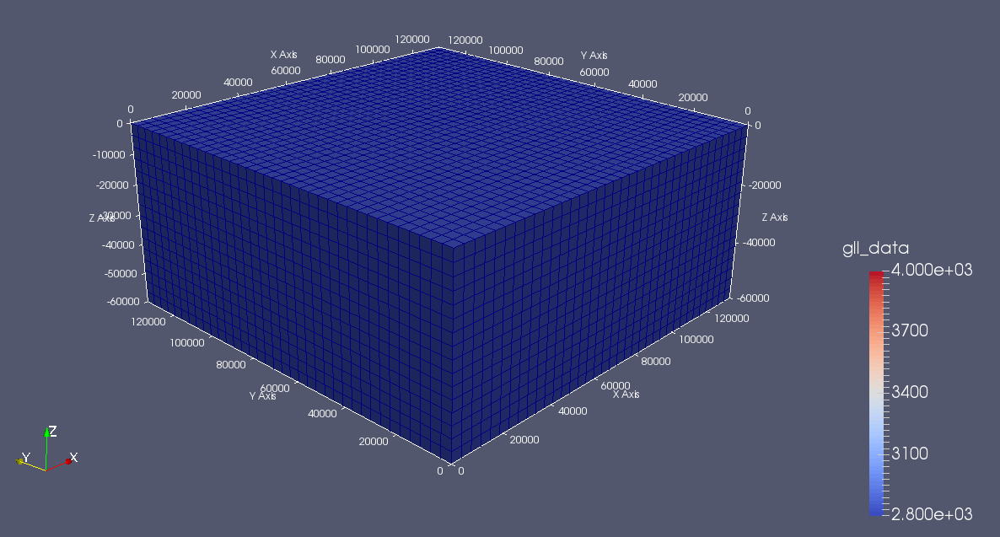
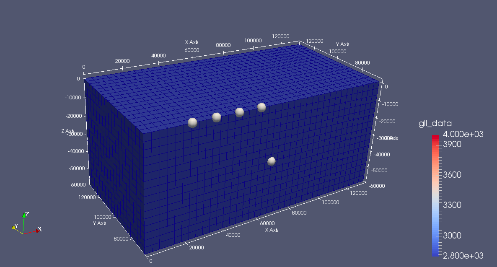
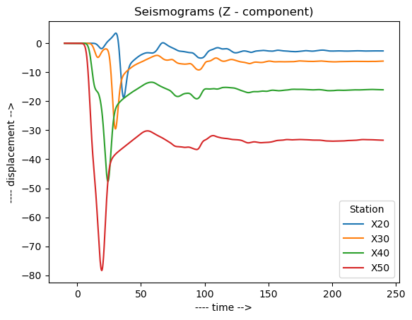
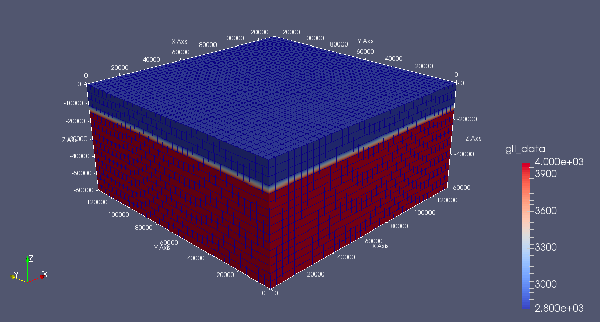
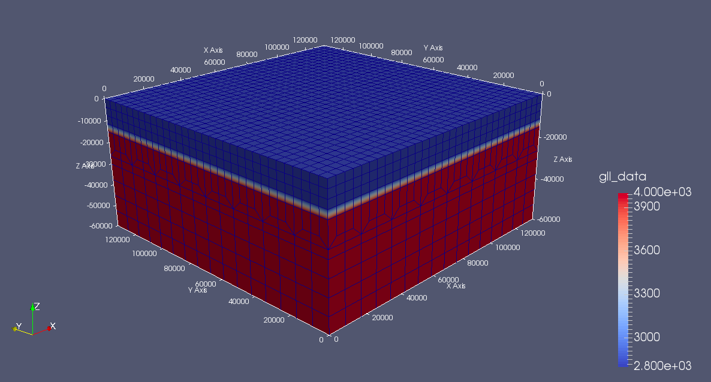
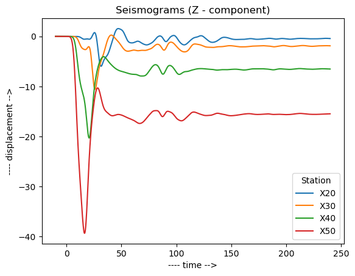

# High Performance Seismology — Wavefield Simulations Using SPECFEM
## Notebook 3: Intro to SPECFEM3D

- SPECFEM3D follows very similar practices as SPECFEM2D.  
- What we have learned thus far will help us understand how to run simulations in SPECFEM3D.  
- In this notebook we will be using SPECFEM3D_Cartesian.  
- **Any subsequent use of the term 'SPECFEM3D' will refer to  'SPECFEM3D_cartesian'** and not the other variants (SPECFEM3D_GLOBE, etc).
- The best reference on how to set up and use SPECFEM3D would be the user [manual](https://github.com/geodynamics/specfem3d/blob/devel/doc/USER_MANUAL/manual_SPECFEM3D_Cartesian.pdf).  
- SPECFEM3D has already been set up in our container, and here we will focus on how to use it.   
- In this short introduction, we will explore the SPECFEM3D repository, and then run small example problems with 3D models, starting with a homogeneous halfspace example. 
- For simplicity we will restrict the 3D models to essentially 1D models in this workshop.  
- These instructions should be run from inside the Docker container, using Jupyter Lab (see instructions [here](https://github.com/adjtomo/adjdocs/blob/main/readmes/docker_image_install.md)).

-----------

**Relevant Links:** 
- Today's Notebook: https://github.com/adjtomo/adjdocs/blob/main/workshops/2023-05-12_hps/3_intro_specfem3d.ipynb  
- SPECFEM3D_Cartesian User Manual: https://github.com/geodynamics/specfem3d/blob/devel/doc/USER_MANUAL/manual_SPECFEM3D_Cartesian.pdf
- SPECFEM3D_Cartesian GitHub Repository: https://github.com/geodynamics/specfem3d/tree/devel  

**Jupyter Quick Tips:**

- **Run cells** one-by-one by hitting the $\blacktriangleright$ button at the top, or by hitting `Shift + Enter`
- **Run all cells** by hitting the $\blacktriangleright\blacktriangleright$ button at the top, or by running `Run -> Run All Cells`
- **Currently running cells** that are still processing will have a `[*]` symbol next to them
- **Finished cells** will have a `[1]` symbol next to them. The number inside the brackets represents what order this cell has been run in.
- Commands that start with `!` are Bash commands (i.e., commands you would run from the terminal)
- Commands that start with `%` are Jupyter Magic commands.
- To time a task, put a `%time` before the command (e.g., `%time ! ls`)

------------
## 1) Package Exploration

Let's get started by looking at the SPECFEM3D repository.


```python
# Python packages we will need for this notebook
import matplotlib.pyplot as plt
import numpy as np
from IPython.display import Image
```


```python
# Go to the SPECFEM3D directory
%cd /home/scoped/specfem3d

# Exploring the SPECFEM3D directory
! ls
```

    /home/scoped/specfem3d
    AUTHORS        config.sub	flags.guess  Makefile.in	  src
    bin	       configure	install-sh   MESH-default	  tests
    CITATION.cff   configure.ac	lib	     OUTPUT_FILES	  utils
    config.guess   CONTRIBUTING.md	LICENSE      README.md		  VERSION
    config.log     DATA		m4	     run_this_example.sh
    config.status  EXAMPLES		Makefile     setup


Among the many folders (and files) listed above, the most notable ones are -
- `bin/`
- `DATA/`
- `OUTPUT_FILES/`
- `EXAMPLES/`
- `src/`

Let's look at these folders one by one.

### 1a) ' bin/ ' directory


```python
! ls bin
```

    xadd_model_iso
    xcheck_mesh_quality
    xclip_sem
    xcombine_sem
    xcombine_surf_data
    xcombine_vol_data
    xcombine_vol_data_vtk
    xcombine_vol_data_vtk_bin
    xcombine_vol_data_vtu
    xconvert_skewness_to_angle
    xconvolve_source_timefunction
    xcreate_movie_shakemap_AVS_DX_GMT
    xdecompose_mesh
    xdecompose_mesh_mpi
    xdetect_duplicates_stations_file
    xgenerate_databases
    xinverse_problem_for_model
    xmeshfem3D
    xmodel_update
    xproject_and_combine_vol_data_on_regular_grid
    xsmooth_sem
    xspecfem3D
    xsum_kernels
    xsum_preconditioned_kernels


- The `bin/` folder contains binary executable files which are essentially linked compiled fortran code generated after compiling various programs available with this package  
- The most essential executables for a basic simulation are:  
    - `xmeshfem3D`: also called SPECFEM3D's internal mesher, this program discretizes the simulation domain into small elements  
    - `xgenerate_databases`: this database generation program assigns model parameter values to the elements  
    - `xspecfem3D`: also called the solver, this program uses the mesh and the corresponding model parameter values assigned to the mesh elements, for numerically solving the wave equation  
    
### 1b) ' DATA/ ' directory


```python
! ls DATA
```

    CMTSOLUTION    observation_grid_to_use_for_gravity.txt	STATIONS
    FORCESOLUTION  Par_file					STATIONS_ADJOINT


The `DATA/` folder is the input files folder and contains files and folders which describe the -
- mesh: (`meshfem3D_files/`)
- model: (`meshfem3D_files/`, `tomo_files/`)
- source: (`CMTSOLUTION`, `FORCESOLUTION`)
- station: (`STATIONS`)

### 1c) ' OUTPUT_FILES/ ' directory


```python
! ls OUTPUT_FILES
```

    DATABASES_MPI


- This `OUTPUT_FILES/` folder contains the output files of any SPECFEM3D job.   
- The `DATABASES_MPI/` folder in the `OUTPUT_FILES/` folder contains the database files generated as a result of a meshing or database generation job. The database files can be very large in size.  
- Other job files like log files for the various programs as well as the output seismograms are directly generated in the `OUTPUT_FILES/` folder.

### 1d) ' src/ ' directory


```python
! ls src
```

    auxiliaries	    generate_databases	       meshfem3D  tomography
    check_mesh_quality  gpu			       shared
    decompose_mesh	    inverse_problem_for_model  specfem3D


- The `src/` folder contains the source code for the various programs in SPECFEM3D.  
- If you want to add to or modify some of SPECFEM3D's features, you need to modify one or more of the files in the 'src/' subfolders. 
- If you think the features you added would be useful to the broader SPECFEM3D community, please consider making a pull request to the SPECFEM3D github [repository](https://github.com/geodynamics/specfem3d/tree/devel) so that it can be reviewed and integrated to the package.  

### 1e) ' EXAMPLES/ ' directory


```python
! ls EXAMPLES
```

    homogeneous_halfspace
    notebooks
    process_DATA_Par_files_to_update_their_parameters_from_a_main_file.py
    README.md


- The `EXAMPLES/` folder contains a variety of examples to provide a quick start to the user on how to use SPECFEM3D and its various features. 
- The README files within the example folders within `EXAMPLES/` guide the user through the steps to run each example.  
- Some of the highly recommended examples to start with, depending on your need to run SPECFEM3D, are:
    - `homogeneous_halfspace/` - a simple homogeneous halfspace model based simulation
    - `meshfem3D_examples/socal1D/` - a layered model based simulation
    - `sensitivity_kernels_liutromp2006/` - adjoint simulations to generate the kernels in [Liu&Tromp 2006](https://pubs.geoscienceworld.org/ssa/bssa/article/96/6/2383/146674/Finite-Frequency-Kernels-Based-on-Adjoint-Methods)

>__NOTE:__ README files, with steps to run these examples, should not undermine the detailing provided in the [manual](https://github.com/geodynamics/specfem3d/blob/master/doc/USER_MANUAL) on how to run SPECFEM3D.


- Here we will start with the `homogeneous halfspace/` example, and then move on to running simulations with layered models.  
- We will also discuss some strategies to design meshes using SPECFEM3D's internal mesher.  

-----------

## 2) Setting Up Simulations

- It is often desirable to run SPECFEM outside of the cloned SPECFEM repository, in order to keep files and outputs manageable. 
- SPECFEM3D only requires the following 3 directories for a successful run -
    - `bin/` (with compiled executables)
    - `DATA/` (with the necessary input files)
    - `OUTPUT_FILES/`

In this section we will set up a separate SPECFEM3D working directory to work with.

>__NOTE:__ The following cells assume that we are in the directory `/home/scoped/work/day_1/specfem3d_workdir`, so we must evaluate the '%cd' command (if needed) to ensure that cells work as expected.


```python
# Create separate working directory for SPECFEM3D
! mkdir -p /home/scoped/work/day_1/specfem3d_workdir

# Go to the SPECFEM3D working directory
%cd /home/scoped/work/day_1/specfem3d_workdir

# Symlink the binary files, and copy the relevant DATA/ directory
! ln -s /home/scoped/specfem3d/bin .
! mkdir -p OUTPUT_FILES/DATABASES_MPI

# Look at the work directory
! ls
```

    /home/scoped/work/day_1/specfem3d_workdir
    ln: failed to create symbolic link './bin': File exists
    bin  DATA  example_A.png  OUTPUT_FILES	record_section.png  seis.png  sr.png


- The work directory now has the `bin/` and the `OUTPUT_FILES/` folders.
- The `DATA/` folder will be added in the subsequent sections depending on the example we want to run.

-----------

## 3) Simulations

A SPECFEM3D simulation primarily involves three steps -
- meshing
- database generation
- solving the wave equation

We will go through these steps in the following example.

### 3a) Homogeneous Halfspace

This example creates a homogeneous halfspace, i.e. a single volume block with a
constant elastic material property, using SPECFEM3D's internal mesher, and runs a
forward simulation.


```python
# Copy necessary input files for the homogeneous halfspace example
! cp -r /home/scoped/specfem3d/EXAMPLES/homogeneous_halfspace/DATA .
! cp -r /home/scoped/specfem3d/EXAMPLES/homogeneous_halfspace/meshfem3D_files DATA/.

# Look at the DATA directory
! ls DATA
```

    CMTSOLUTION	 observation_grid_to_use_for_gravity.txt  STATIONS_ADJOINT
    FORCESOLUTION	 Par_file				  STATIONS_FILTERED
    meshfem3D_files  STATIONS


#### Step 1) Meshing: Simulation domain discretization


```python
# Explore the mesh files
! ls DATA/meshfem3D_files
```

    interface1.txt	interfaces.txt	Mesh_Par_file


```python
# Check the Mesh_Par_file
! cat DATA/meshfem3D_files/Mesh_Par_file
```

    #-----------------------------------------------------------
    #
    # Meshing input parameters
    #
    #-----------------------------------------------------------
    
    # coordinates of mesh block in latitude/longitude and depth in km
    LATITUDE_MIN                    = 0.0
    LATITUDE_MAX                    = 134000.0
    LONGITUDE_MIN                   = 0.0
    LONGITUDE_MAX                   = 134000.0
    DEPTH_BLOCK_KM                  = 60.d0
    UTM_PROJECTION_ZONE             = 11
    SUPPRESS_UTM_PROJECTION         = .true.
    
    # file that contains the interfaces of the model / mesh
    INTERFACES_FILE                 = interfaces.txt
    
    # file that contains the cavity
    CAVITY_FILE                     = no_cavity.dat
    
    # number of elements at the surface along edges of the mesh at the surface
    # (must be 8 * multiple of NPROC below if mesh is not regular and contains mesh doublings)
    # (must be multiple of NPROC below if mesh is regular)
    NEX_XI                          = 36
    NEX_ETA                         = 36
    
    # number of MPI processors along xi and eta (can be different)
    NPROC_XI                        = 2
    NPROC_ETA                       = 2
    
    #-----------------------------------------------------------
    #
    # Doubling layers
    #
    #-----------------------------------------------------------
    
    # Regular/irregular mesh
    USE_REGULAR_MESH                = .true.
    # Only for irregular meshes, number of doubling layers and their position
    NDOUBLINGS                      = 0
    # NZ_DOUBLING_1 is the parameter to set up if there is only one doubling layer
    # (more doubling entries can be added if needed to match NDOUBLINGS value)
    NZ_DOUBLING_1                   = 40
    NZ_DOUBLING_2                   = 48
    
    #-----------------------------------------------------------
    #
    # Visualization
    #
    #-----------------------------------------------------------
    
    # create mesh files for visualisation or further checking
    CREATE_ABAQUS_FILES             = .false.
    CREATE_DX_FILES                 = .false.
    CREATE_VTK_FILES                = .true.
    
    # stores mesh files as cubit-exported files into directory MESH/ (for single process run)
    SAVE_MESH_AS_CUBIT              = .false.
    
    # path to store the databases files
    LOCAL_PATH                      = ./OUTPUT_FILES/DATABASES_MPI
    
    #-----------------------------------------------------------
    #
    # CPML
    #
    #-----------------------------------------------------------
    
    # CPML perfectly matched absorbing layers
    THICKNESS_OF_X_PML              = 12.3d0
    THICKNESS_OF_Y_PML              = 12.3d0
    THICKNESS_OF_Z_PML              = 12.3d0
    
    #-----------------------------------------------------------
    #
    # Domain materials
    #
    #-----------------------------------------------------------
    
    # number of materials
    NMATERIALS                      = 1
    # define the different materials in the model as:
    # #material_id  #rho  #vp  #vs  #Q_Kappa  #Q_mu  #anisotropy_flag  #domain_id
    #     Q_Kappa          : Q_Kappa attenuation quality factor
    #     Q_mu             : Q_mu attenuation quality factor
    #     anisotropy_flag  : 0 = no anisotropy / 1,2,... check the implementation in file aniso_model.f90
    #     domain_id        : 1 = acoustic / 2 = elastic
    1   2300.0   2800.0   1500.0   2444.4    300.0 0 2
    
    #-----------------------------------------------------------
    #
    # Domain regions
    #
    #-----------------------------------------------------------
    
    # number of regions
    NREGIONS                        = 1
    # define the different regions of the model as :
    #NEX_XI_BEGIN  #NEX_XI_END  #NEX_ETA_BEGIN  #NEX_ETA_END  #NZ_BEGIN #NZ_END  #material_id
    1             36             1              36        1        16              1
    


```python
# Run mesher (xmeshfem3D)
! mpiexec -np 4 ./bin/xmeshfem3D

# Look at the generated mesh files
! ls OUTPUT_FILES/DATABASES_MPI
```

    proc000000_Database	 proc000001_mesh.vtk	  proc000002_skewness.vtk
    proc000000_mesh.vtk	 proc000001_skewness.vtk  proc000003_Database
    proc000000_skewness.vtk  proc000002_Database	  proc000003_mesh.vtk
    proc000001_Database	 proc000002_mesh.vtk	  proc000003_skewness.vtk


#### Step 2) Database Generation: Model assignment to mesh


```python
# Run database generator (xgenerate_databases)
! mpiexec -np 4 ./bin/xgenerate_databases

# Explore the generated database files
! ls OUTPUT_FILES/DATABASES_MPI
```

    proc000000_Database		   proc000002_Database
    proc000000_external_mesh.bin	   proc000002_external_mesh.bin
    proc000000_free_surface.vtk	   proc000002_free_surface.vtk
    proc000000_ibool.bin		   proc000002_ibool.bin
    proc000000_mesh.vtk		   proc000002_mesh.vtk
    proc000000_MPI_points.vtk	   proc000002_MPI_points.vtk
    proc000000_qkappa.bin		   proc000002_qkappa.bin
    proc000000_qkappa.vtk		   proc000002_qkappa.vtk
    proc000000_qmu.bin		   proc000002_qmu.bin
    proc000000_qmu.vtk		   proc000002_qmu.vtk
    proc000000_res_minimum_period.vtu  proc000002_res_minimum_period.vtu
    proc000000_rho.bin		   proc000002_rho.bin
    proc000000_skewness.vtk		   proc000002_skewness.vtk
    proc000000_vp.bin		   proc000002_vp.bin
    proc000000_vp.vtk		   proc000002_vp.vtk
    proc000000_vs.bin		   proc000002_vs.bin
    proc000000_vs.vtk		   proc000002_vs.vtk
    proc000000_x.bin		   proc000002_x.bin
    proc000000_y.bin		   proc000002_y.bin
    proc000000_z.bin		   proc000002_z.bin
    proc000001_Database		   proc000003_Database
    proc000001_external_mesh.bin	   proc000003_external_mesh.bin
    proc000001_free_surface.vtk	   proc000003_free_surface.vtk
    proc000001_ibool.bin		   proc000003_ibool.bin
    proc000001_mesh.vtk		   proc000003_mesh.vtk
    proc000001_MPI_points.vtk	   proc000003_MPI_points.vtk
    proc000001_qkappa.bin		   proc000003_qkappa.bin
    proc000001_qkappa.vtk		   proc000003_qkappa.vtk
    proc000001_qmu.bin		   proc000003_qmu.bin
    proc000001_qmu.vtk		   proc000003_qmu.vtk
    proc000001_res_minimum_period.vtu  proc000003_res_minimum_period.vtu
    proc000001_rho.bin		   proc000003_rho.bin
    proc000001_skewness.vtk		   proc000003_skewness.vtk
    proc000001_vp.bin		   proc000003_vp.bin
    proc000001_vp.vtk		   proc000003_vp.vtk
    proc000001_vs.bin		   proc000003_vs.bin
    proc000001_vs.vtk		   proc000003_vs.vtk
    proc000001_x.bin		   proc000003_x.bin
    proc000001_y.bin		   proc000003_y.bin
    proc000001_z.bin		   proc000003_z.bin


```python
# View the meshing and the Vp model
# The following image was generated using Paraview
! cp /home/scoped/adjdocs/workshops/2022-10-05_specfem_users/additional_material/day_1c/figures/mesh/example_A.png .
Image("example_A.png")
```


    

    


**Fig.** The homogeneous halfspace velocity (Vp) model and mesh. The model spans 134 km in the 'X' and 'Y' directions, and 60 km in the 'Z' direction. The mesh has 36 elements in the 'X' and 'Y' directions, and has 16 elements in the 'Z' direction. The halfspace has a Vp value of 2.8 km/s.

#### Step 3) Simulation: Solving the wave equation


```python
# Check the source definition
! cat DATA/CMTSOLUTION
```

    PDE  1999 01 01 00 00 00.00  67000 67000 -25000 4.2 4.2 homog_test
    event name:       homog_test
    time shift:       0.0000
    half duration:    5.0
    latorUTM:       67000.0
    longorUTM:      67000.0
    depth:          30.0
    Mrr:      -7.600000e+27
    Mtt:       7.700000e+27
    Mpp:      -2.000000e+26
    Mrt:      -2.500000e+28
    Mrp:       4.000000e+26
    Mtp:      -2.500000e+27


Read more about the CMTSOLUTION files [here](https://www.sciencedirect.com/science/article/pii/S0031920112000696?via%3Dihub).


```python
# Check the stations file
! cat DATA/STATIONS
```

    X20 DB 67000.00 22732.14 0.0 0.0
    X30 DB 67000.00 34696.43 0.0 0.0
    X40 DB 67000.00 46660.71 0.0 0.0
    X50 DB 67000.00 58625.00 0.0 0.0


```python
# View the meshing and the Vp model (figure pre-generated using ParaView)
! cp /home/scoped/adjdocs/workshops/2022-10-05_specfem_users/additional_material/day_1c/figures/source_station_geometry/sr.png .
Image("sr.png")
```


    

    


**Fig.** The source station geometry, in the homogeneous halfspace domain with the 'Y' dimension cut in half. The source and stations are placed on the plane of the slice. The source is at the center of the grid, while the stations are equally spaced on a section along the surface.


```python
# Check the Par_file
! head -30 DATA/Par_file
```

    #-----------------------------------------------------------
    #
    # Simulation input parameters
    #
    #-----------------------------------------------------------
    
    # forward or adjoint simulation
    # 1 = forward, 2 = adjoint, 3 = both simultaneously
    SIMULATION_TYPE                 = 1
    # 0 = earthquake simulation,  1/2/3 = three steps in noise simulation
    NOISE_TOMOGRAPHY                = 0
    SAVE_FORWARD                    = .false.
    
    # solve a full FWI inverse problem from a single calling program with no I/Os, storing everything in memory,
    # or run a classical forward or adjoint problem only and save the seismograms and/or sensitivity kernels to disk (with costlier I/Os)
    INVERSE_FWI_FULL_PROBLEM        = .false.
    
    # UTM projection parameters
    # Use a negative zone number for the Southern hemisphere:
    # The Northern hemisphere corresponds to zones +1 to +60,
    # The Southern hemisphere corresponds to zones -1 to -60.
    UTM_PROJECTION_ZONE             = 11
    SUPPRESS_UTM_PROJECTION         = .true.
    
    # number of MPI processors
    NPROC                           = 4
    
    # time step parameters
    NSTEP                           = 5000
    DT                              = 0.05


```python
! head -80 DATA/Par_file | tail -n 22
```

    # models:
    # available options are:
    #   default (model parameters described by mesh properties)
    # 1D models available are:
    #   1d_prem,1d_socal,1d_cascadia
    # 3D models available are:
    #   aniso,external,gll,salton_trough,tomo,SEP,coupled,...
    MODEL                           = default
    
    # path for external tomographic models files
    TOMOGRAPHY_PATH                 = DATA/tomo_files/
    # if you are using a SEP model (oil-industry format)
    SEP_MODEL_DIRECTORY             = DATA/my_SEP_model/
    
    #-----------------------------------------------------------
    
    # parameters describing the model
    APPROXIMATE_OCEAN_LOAD          = .false.
    TOPOGRAPHY                      = .false.
    ATTENUATION                     = .false.
    ANISOTROPY                      = .false.
    GRAVITY                         = .false.


```python
# Run the solver (xspecfem3D)
%time ! mpiexec -np 4 ./bin/xspecfem3D
```

    CPU times: user 1.54 s, sys: 320 ms, total: 1.86 s
    Wall time: 1min 36s


>__NOTE:__ solver runs should take ~5 minutes or less on a recent (as of 2022) laptop.

Note the wall time for the simulation.


```python
# Look at the simulation output files
! ls OUTPUT_FILES/
```

    DATABASES_MPI	 error_message000000.txt	  surface_from_mesher.h
    DB.X20.BXX.semd  error_message000001.txt	  timestamp000005
    DB.X20.BXY.semd  error_message000002.txt	  timestamp000500
    DB.X20.BXZ.semd  error_message000003.txt	  timestamp001000
    DB.X30.BXX.semd  mesh_quality_histogram.txt	  timestamp001500
    DB.X30.BXY.semd  output_generate_databases.txt	  timestamp002000
    DB.X30.BXZ.semd  output_list_sources.txt	  timestamp002500
    DB.X40.BXX.semd  output_list_stations.txt	  timestamp003000
    DB.X40.BXY.semd  output_meshfem3D.txt		  timestamp003500
    DB.X40.BXZ.semd  output_solver.txt		  timestamp004000
    DB.X50.BXX.semd  plot_mesh_quality_histogram.gnu  timestamp004500
    DB.X50.BXY.semd  sr.vtk				  timestamp005000
    DB.X50.BXZ.semd  starttimeloop.txt		  values_from_mesher.h


```python
# Explore the seismograms
! head -25 OUTPUT_FILES/DB.X50.BXZ.semd 
```

      -10.0000000       0.00000000    
      -9.94999981       0.00000000    
      -9.89999962       0.00000000    
      -9.85000038       0.00000000    
      -9.80000019       0.00000000    
      -9.75000000       0.00000000    
      -9.69999981       0.00000000    
      -9.64999962       0.00000000    
      -9.60000038       0.00000000    
      -9.55000019      -6.22681562E-22
      -9.50000000      -6.69273166E-21
      -9.44999981      -2.77860469E-20
      -9.39999962      -4.33739707E-21
      -9.35000038       6.08117078E-19
      -9.30000019       4.13693166E-18
      -9.25000000       1.72378782E-17
      -9.19999981       5.32048162E-17
      -9.14999962       1.27827727E-16
      -9.10000038       2.36291170E-16
      -9.05000019       2.98326433E-16
      -9.00000000       7.95162436E-17
      -8.94999981      -8.47515544E-16
      -8.89999962      -2.95600438E-15
      -8.85000038      -6.23830025E-15
      -8.80000019      -9.21666291E-15


```python
# Plot the seismograms
X20_Z = np.genfromtxt("OUTPUT_FILES/DB.X20.BXZ.semd", dtype=None, names=("time","BXZ"))
X30_Z = np.genfromtxt("OUTPUT_FILES/DB.X30.BXZ.semd", dtype=None, names=("time","BXZ"))
X40_Z = np.genfromtxt("OUTPUT_FILES/DB.X40.BXZ.semd", dtype=None, names=("time","BXZ"))
X50_Z = np.genfromtxt("OUTPUT_FILES/DB.X50.BXZ.semd", dtype=None, names=("time","BXZ"))

t = X20_Z["time"]

plt.title("Seismograms (Z - component)")
plt.xlabel("---- time -->")
plt.ylabel("---- displacement -->")

plt.plot(t,X20_Z["BXZ"],label="X20")
plt.plot(t,X30_Z["BXZ"],label="X30")
plt.plot(t,X40_Z["BXZ"],label="X40")
plt.plot(t,X50_Z["BXZ"],label="X50")

plt.legend(title="Station")
plt.savefig("seis.png")
```


    

    


```python
# Remove the large sized database files
! rm -rf /home/scoped/work/day_1/specfem3d_workdir/OUTPUT_FILES/DATABASES_MPI

# Archive the output files, and the mesh files
! mv sr.png OUTPUT_FILES/.
! mv example_A.png OUTPUT_FILES/mesh_examples_A.png
! mv seis.png OUTPUT_FILES/.
! mv OUTPUT_FILES OUTPUT_FILES_example_A
! mv DATA/meshfem3D_files DATA/meshfem3D_files_example_A
```

-----------

### 3b) Two Layered Model

This example is built upon the homogeneous halfspace model of the previous example, with the bottom three-fourths of the domain assigned higher velocities and density.


```python
# Setup
! cp -r /home/scoped/adjdocs/workshops/2022-10-05_specfem_users/additional_material/day_1c/meshfem3D_files/example_B DATA/meshfem3D_files
! mkdir -p OUTPUT_FILES/DATABASES_MPI

! ls DATA/meshfem3D_files
```

    interface1.txt	interface2.txt	interfaces.txt	Mesh_Par_file


```python
# Check the difference
! diff --color DATA/meshfem3D_files_example_A/Mesh_Par_file DATA/meshfem3D_files/Mesh_Par_file
```

    82c82
    < NMATERIALS                      = 1
    ---
    > NMATERIALS                      = 2
    89c89,90
    < 1   2300.0   2800.0   1500.0   2444.4    300.0 0 2
    ---
    > 1   2800.0   4000.0   2100.0   2444.4    300.0 0 2
    > 2   2300.0   2800.0   1500.0   2444.4    300.0 0 2
    98c99
    < NREGIONS                        = 1
    ---
    > NREGIONS                        = 2
    101,102c102,103
    < 1             36             1              36        1        16              1
    < 
    ---
    >        1             36             1              36        1        12              1
    >        1             36             1              36       13        16              2


- Here we assign higher velocities and density, to the bottom 45 km of the model, compared to that of the previous example, hence creating two separate layers.
- The domain discretization (meshing) remains the same.

>__NOTE:__ Here, the counting of various quantities, starts from the bottom layer


```python
# Run mesher (xmeshfem3D)
! mpiexec -np 4 ./bin/xmeshfem3D

# Run database generator (xgenerate_databases)
! mpiexec -np 4 ./bin/xgenerate_databases
```


```python
# View the meshing and the Vp model (figure pre-generated using ParaView)
! cp /home/scoped/adjdocs/workshops/2022-10-05_specfem_users/additional_material/day_1c/figures/mesh/example_B.png .
Image("example_B.png")
```


    

    


**Fig.** The two layered velocity (Vp) model and mesh. The 15 km thick top layer has Vp = 2.8 km/s, while the 45 km thick bottom layer has Vp = 4.0 km/s. The discretization is the same as that used in the homogeneous halfspace example, with the top layer having 4 elements in the 'Z' direction, and the bottom layer having 12 elements in the 'Z' direction. 


```python
# Run the solver (xspecfem3D)
%time ! mpiexec -np 4 ./bin/xspecfem3D
```

    CPU times: user 1.96 s, sys: 385 ms, total: 2.34 s
    Wall time: 1min 56s


>__NOTE:__ solver runs should take ~5 minutes or less on a recent (as on 2022) laptop.

Note the wall time for the simulation.


```python
# Plot the output seismograms
X20_Z = np.genfromtxt("OUTPUT_FILES/DB.X20.BXZ.semd", dtype=None, names=("time","BXZ"))
X30_Z = np.genfromtxt("OUTPUT_FILES/DB.X30.BXZ.semd", dtype=None, names=("time","BXZ"))
X40_Z = np.genfromtxt("OUTPUT_FILES/DB.X40.BXZ.semd", dtype=None, names=("time","BXZ"))
X50_Z = np.genfromtxt("OUTPUT_FILES/DB.X50.BXZ.semd", dtype=None, names=("time","BXZ"))

t = X20_Z["time"]

plt.title("Seismograms (Z - component)")
plt.xlabel("---- time -->")
plt.ylabel("---- displacement -->")

plt.plot(t,X20_Z["BXZ"],label="X20")
plt.plot(t,X30_Z["BXZ"],label="X30")
plt.plot(t,X40_Z["BXZ"],label="X40")
plt.plot(t,X50_Z["BXZ"],label="X50")

plt.legend(title="Station")
plt.savefig("seis.png")
```


```python
# Remove the large sized database files
! rm -rf /home/scoped/work/day_1/specfem3d_workdir/OUTPUT_FILES/DATABASES_MPI

# Archive the output files, and the mesh files
! mv example_B.png OUTPUT_FILES/mesh_examples_B.png
! mv seis.png OUTPUT_FILES/.
! mv OUTPUT_FILES OUTPUT_FILES_example_B
! mv DATA/meshfem3D_files DATA/meshfem3D_files_example_B
```

-----------

### 3c) Two Layered Model with Modified Mesh

This example is built upon the two layered model used in the previous example, with larger elements for the higher velocity layer.


```python
# Setup
! cp -r /home/scoped/adjdocs/workshops/2022-10-05_specfem_users/additional_material/day_1c/meshfem3D_files/example_C DATA/meshfem3D_files
! mkdir -p OUTPUT_FILES/DATABASES_MPI

! ls DATA/meshfem3D_files
```


```python
# Check the difference
! diff --color DATA/meshfem3D_files_example_B/Mesh_Par_file DATA/meshfem3D_files/Mesh_Par_file 
```

- Here we have doubled the vertical dimension of the bottom layer elements compared to that of the previous example.
- We have also added a doubling layer to transition from smaller elements in the top layer to larger (double sized) elements in the bottom layer.
- Since the mesh is no longer regular, and has doubling layers, the number of elements along the 'X' and 'Y' direction at the surface need to be multiples of 8.

>__NOTE:__ Here, the counting of various quantities, starts from the bottom layer  


```python
# Run mesher (xmeshfem3D)
! mpiexec -np 4 ./bin/xmeshfem3D

# Run database generator (xgenerate_databases)
! mpiexec -np 4 ./bin/xgenerate_databases
```


```python
# View the meshing and the Vp model (figure pre-generated using ParaView)
! cp /home/scoped/adjdocs/workshops/2022-10-05_specfem_users/additional_material/day_1c/figures/mesh/example_C.png .
Image("example_C.png")
```


    

    


**Fig.** The two layered velocity (Vp) model with modified mesh. The 15 km thick top layer has Vp = 2.8 km/s, while the 45 km thick bottom layer has Vp = 4.0 km/s. The discretization is the same for the top layer, with 4 elements in the 'Z' direction, while the bottom layer has about half the elements (~6 elements) in the 'Z' direction, as compared to the previous examples. The bottom layer also has half the elements (16 elements) along the 'X' and 'Y' directions as compared to that in the top layer (32 elements) of this example.


```python
# Run the solver (xspecfem3D)
%time ! mpiexec -np 4 ./bin/xspecfem3D
```

>__NOTE:__ solver runs should take ~5 minutes or less on a recent (as on 2022) laptop.

Note the wall time for the simulation.


```python
# Plot the output seismograms
X20_Z = np.genfromtxt("OUTPUT_FILES/DB.X20.BXZ.semd", dtype=None, names=("time","BXZ"))
X30_Z = np.genfromtxt("OUTPUT_FILES/DB.X30.BXZ.semd", dtype=None, names=("time","BXZ"))
X40_Z = np.genfromtxt("OUTPUT_FILES/DB.X40.BXZ.semd", dtype=None, names=("time","BXZ"))
X50_Z = np.genfromtxt("OUTPUT_FILES/DB.X50.BXZ.semd", dtype=None, names=("time","BXZ"))

t = X20_Z["time"]

plt.title("Seismograms (Z - component)")
plt.xlabel("---- time -->")
plt.ylabel("---- displacement -->")

plt.plot(t,X20_Z["BXZ"],label="X20")
plt.plot(t,X30_Z["BXZ"],label="X30")
plt.plot(t,X40_Z["BXZ"],label="X40")
plt.plot(t,X50_Z["BXZ"],label="X50")

plt.legend(title="Station")
plt.savefig("seis.png")
```


    

    


- By increasing the element size for the higher velocity layer, we are able to speed up the simulation greatly without any loss of accuracy in the results.  
- Selecting mesh element dimensions is governed by several factors -
    - frequencies of interest in the seismograms
    - velocity model
    - computational accuracy required
    - computational time available
- The quality of the mesh, as described in detail in [Komatitsch & Tromp 2002a](https://academic.oup.com/gji/article/149/2/390/727101), is reflected by -
    - number of grid points per wavelength
    - the stability condition


```python
# Remove the large sized database files
! rm -rf /home/scoped/work/day_1/specfem3d_workdir/OUTPUT_FILES/DATABASES_MPI

# Archive the output files, and the mesh files
! mv example_C.png OUTPUT_FILES/mesh_examples_C.png
! mv seis.png OUTPUT_FILES/.
! mv OUTPUT_FILES OUTPUT_FILES_example_C
! mv DATA/meshfem3D_files DATA/meshfem3D_files_example_C
```

-----------

**Congratulations! You have reached your destination.**
